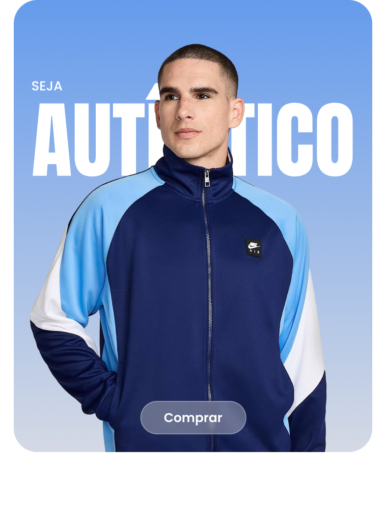

# 🛍️ BEWEAR - E-commerce de Moda (📱 Responsivo)


Um e-commerce completo de moda e roupas, desenvolvido com tecnologias modernas e focado na experiência do usuário.

## 📌 Objetivo do Projeto

Este projeto apresenta uma plataforma de comércio eletrônico totalmente funcional, permitindo que os usuários naveguem por produtos de vestuário, gerenciem seus carrinhos de compra e finalizem pedidos com segurança. A experiência foi projetada para ser intuitiva, responsiva e esteticamente atraente.

## ✨ Principais Funcionalidades

- 🛍️ **Catálogo de Produtos**: Navegação intuitiva por categorias e itens
- 🛒 **Carrinho de Compras**: Gestão completa dos itens selecionados
- 💳 **Checkout Seguro com Stripe**: Processamento de pagamentos confiável
- 🔐 **Autenticação**: Login e cadastro de usuários
- 📦 **Gestão de Pedidos**: Acompanhamento completo do status
- 📱 **Design Responsivo**: Experiência otimizada para todos os dispositivos
- 🔎 **Recomendações Personalizadas**: Sugestões de produtos complementares

## 🖼️ Prévia do Projeto



## 💡 Motivação

Este projeto foi desenvolvido para demonstrar a implementação de um e-commerce moderno e completo usando as tecnologias mais recentes. A BEWEAR representa uma marca fictícia de roupas e acessórios, criada para oferecer uma experiência de compra online imersiva e satisfatória.

## 🛠️ Tecnologias Utilizadas

- **Frontend**:
  - ⚛️ Next.js 15 + React 19
  - 🔷 TypeScript
  - 🎨 Tailwind CSS
  - 🧩 Radix UI + shadcn/ui

- **Backend**:
  - 🔄 Next.js API Routes
  - 🗃️ Drizzle ORM
  - 🐘 PostgreSQL
  - 🔐 Better Auth
  - 💰 Stripe Payments
  - 🔄 TanStack Query

## 🚀 Instalação e Configuração

### Requisitos Prévios

- Node.js 18+
- PostgreSQL
- Conta Stripe (para processamento de pagamentos)

### Configuração do Ambiente

1. Clone o repositório:

```bash
git clone https://github.com/seu-usuario/bewear-ecommerce.git
cd bewear-ecommerce
```

2. Crie um arquivo `.env.local` na raiz do projeto:

```bash
# Stripe
STRIPE_SECRET_KEY=sk_test_...
STRIPE_WEBHOOK_SECRET=whsec_...
NEXT_PUBLIC_STRIPE_PUBLISHABLE_KEY=pk_test_...

# Database
DATABASE_URL=postgresql://...

# Auth
AUTH_SECRET=...
```

3. Instale as dependências:

```bash
npm install
```

4. Configure e popule o banco de dados:

```bash
npm run db:generate
npm run db:push
npm run db:seed
```

5. Inicie o servidor de desenvolvimento:

```bash
npm run dev
```

6. Acesse [http://localhost:3000](http://localhost:3000) no seu navegador

## 📁 Estrutura do Projeto

O projeto segue uma arquitetura organizada e escalável:

```
src/
├── actions/                # Server Actions para operações do backend
├── app/                    # App Router do Next.js
│   ├── api/                # API Routes
│   ├── authentication/     # Sistema de autenticação
│   ├── cart/               # Fluxo do carrinho de compras
│   ├── category/           # Páginas de categorias de produtos
│   ├── checkout/           # Processamento de checkout
│   ├── my-orders/          # Histórico e detalhes de pedidos
│   └── product-variant/    # Páginas de detalhes do produto
├── components/             # Componentes reutilizáveis
│   ├── common/             # Componentes de negócio
│   └── ui/                 # Componentes de interface
├── db/                     # Configuração do banco de dados
│   └── schema.ts           # Schema do Drizzle ORM
├── helpers/                # Funções auxiliares
├── hooks/                  # Custom hooks React
│   ├── mutations/          # Hooks para mutações
│   └── queries/            # Hooks para consultas
├── lib/                    # Utilitários e configurações
└── providers/              # Providers do React Context
```

## 🎯 Recursos Implementados

- ✅ **Sistema de Autenticação**: Login social e gerenciamento de sessões
- ✅ **Catálogo de Produtos**: Categorização, filtros e busca
- ✅ **Carrinho Persistente**: Mantém produtos salvos entre sessões
- ✅ **Checkout Otimizado**: Processo de 3 etapas fácil de usar
- ✅ **Integração com Stripe**: Pagamentos seguros com cartão de crédito
- ✅ **Design Responsivo**: Adaptável a todos os tamanhos de tela
- ✅ **Gestão de Pedidos**: Histórico completo e detalhamento

## 🧠 Desafios e Aprendizados

Durante o desenvolvimento deste projeto, enfrentamos e superamos diversos desafios:

- 🔄 **Estado Global**: Gerenciamento complexo de estados com React Query
- 🛒 **Persistência de Dados**: Carrinho salvo entre sessões e dispositivos
- 📱 **Design Responsivo**: Interface adaptável a todos os tamanhos de tela
- 🔐 **Segurança**: Implementação de autenticação robusta
- 💸 **Integração de Pagamentos**: Processamento seguro com Stripe

## 🌟 Recursos Exclusivos

- 🎨 **Design Personalizado**: Interface moderna e amigável
- 📊 **Recomendações Inteligentes**: Sugestões baseadas na navegação
- ⚡ **Performance Otimizada**: Carregamento rápido e experiência fluida
- 📦 **Checkout em Etapas**: Processo simplificado de compra
- 🌙 **Tema Adaptável**: Interface visual harmoniosa

## 🚀 Deploy

O projeto está configurado para deployment contínuo na [Vercel Platform](https://vercel.com), aproveitando a integração nativa com Next.js para máxima performance.

## 📚 Recursos de Aprendizado

Para aprofundar seus conhecimentos nas tecnologias utilizadas:

- [Documentação do Next.js](https://nextjs.org/docs)
- [Drizzle ORM](https://orm.drizzle.team/)
- [Stripe Payments](https://stripe.com/docs)
- [Tailwind CSS](https://tailwindcss.com/)
- [TanStack Query](https://tanstack.com/query)

## 📝 Licença

Este projeto está licenciado sob a licença MIT. Consulte o arquivo LICENSE para mais detalhes.

Contribuições são bem-vindas! Sinta-se à vontade para abrir issues e pull requests.
